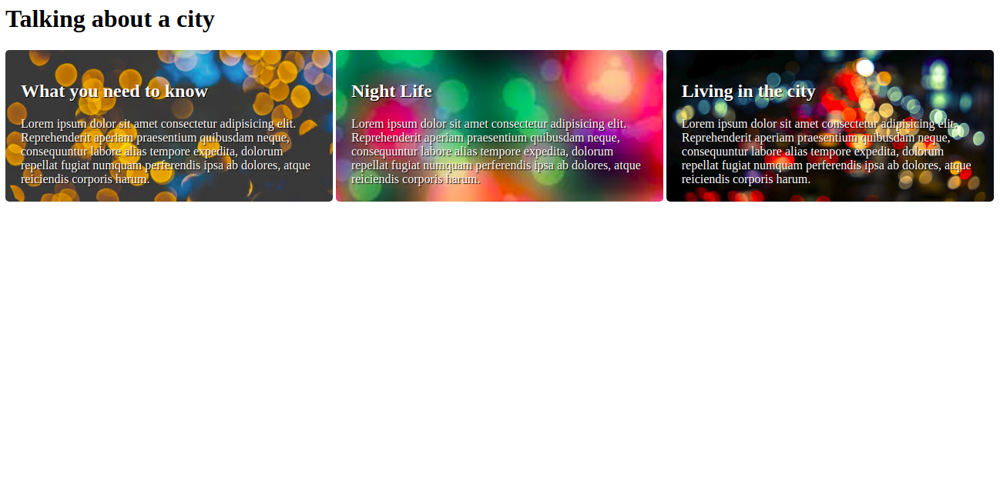

# What's your background? 

**Note**: The task starting files can be found in the corresponding folder names. Each task folder contains the necessary assets.

**Instructions**: 

* Task 1: Add the `background.jpg` in the assets folder as a background image to the header. Set the size to contain and make sure the image repeats across the header. 

* Task 2: Add the background images in the assets folder to each of the sections with the classes of `info-1`, `info-2` and `info-3` (make sure to use a different image for each section). Set the size of the background to cover the whole section element. Make sure that the background does not repeat and that the position is set to bottom. Make sure that you **DRY**.  

**Bonus for task 2**: 
* Add padding to the sections. 
* Make the sections appear side-by-side. 
* Add a border radius to the sections.

